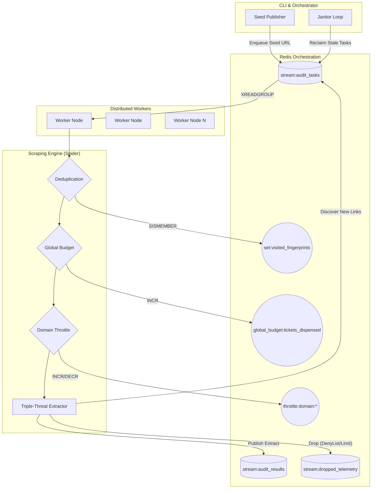

# Nexus Audit Crawler

An enterprise-grade, highly concurrent, distributed web crawler designed to audit and extract data seamlessly while evading modern anti-bot protections. 

Powered by **Scrapling**, **Playwright**, and **Redis Streams**, the architecture employs a "Waterfall Session" model combining the raw speed of datacenter proxies with the evasion capabilities of residential proxy-backed stealth browsers.

---

## System Architecture & Data Flow

The system is fully stateless at the worker level, with all coordination, message queuing, and state persistence delegated to Redis. This decouples the crawler into independently scalable ephemeral workers.

### Architecture Topology



### Triple-Threat Extraction Strategy
To maximize data yield while minimizing execution time, the pipeline cascades through three deterministic strategies:
1. **XHR JSON Capture (Fastest):** Intercepts raw API responses bypassing HTML entirely.
2. **Hydration State Extraction:** Extracts embedded JSON state (`__NEXT_DATA__`, standard JS configs).
3. **MarkItDown Fallback:** Converts the final rendered DOM strictly to lightweight Markdown.

---

## Project Structure

```text
nexus-audit-crawler/
├── .env.example          # Template for environment configuration
├── .gitignore            # Version control exclusions
├── README.md             # Architecture and operation guide
├── requirements.txt      # Python dependencies
├── app/                  # Core application layer
│   ├── config.py         # Pydantic settings loading
│   ├── extraction.py     # Triple-Threat extraction logic
│   ├── logger.py         # Centralized log router
│   ├── main.py           # Worker loop and gate management
│   ├── orchestrator.py   # Task publisher & PEL janitor
│   ├── redis_client.py   # Connection pool and slots
│   ├── spider.py         # Core fetching and stealth logic
│   ├── telemetry.py      # Telemetry sink configuration
│   └── utils/
│       ├── flush_state.py
│       └── utilities.py
├── scripts/              # Standalone data utilities
│   ├── export_data.py    # Export Redis Streams to JSON
│   ├── find_dups.py      # Analyze duplicates in exported data
│   ├── inspect.py        # Output sanity checks
│   └── test_config.py
└── tests/                # Verification tests
    └── smoke_test.py     # End-to-End smoke tests
```

---

## Prerequisites & Environment Setup

1. **Python 3.10+**
2. **Redis Server** (Local or Cloud instance)
3. **Playwright Browsers** (`playwright install chromium`)

### Environment Variables
Copy the provided example environment to `.env` and configure it:
```bash
cp .env.example .env
```
Ensure `REDIS_URL` matches your local/remote instance. Configure `DATACENTER_PROXIES` and `RESIDENTIAL_PROXIES` if IP evasion is required.

---

## Installation & Execution Guide

### 1. Install Dependencies
```bash
python -m venv venv
# Windows
.\venv\Scripts\activate
# Unix
source venv/bin/activate

pip install -r requirements.txt
playwright install chromium
```

### 2. Start Distributed Workers
You can start multiple background workers by running the main module. Workers will connect to Redis and listen for tasks.
```bash
python -m app.main
```

### 3. Publish a Seed URL
To begin an audit, publish a starting URL with a target domain fence. The orchestrator will inject the seed into the stream.
```bash
python -m app.orchestrator --seed https://example.com --domain example.com
```

### 4. Run the Janitor Loop
Launch the Janitor in the background to automatically reclaim stalled tasks from workers that crash abruptly:
```python
import anyio
from app.redis_client import create_redis_pool
from app.orchestrator import janitor_loop

async def run_janitor():
    await janitor_loop(create_redis_pool())
anyio.run(run_janitor)
```

### 5. Flush Crawler State
To execute a scorched-earth reset of the entire pipeline (clears all queues, budget counts, visit states, and domain slots):
```bash
python -m app.orchestrator --flush
```

---

## Pipeline Reference

- **`stream:audit_tasks`**: Main task queue consumed by `app.main` workers.
- **`stream:audit_results`**: Output stream containing successfully extracted payloads.
- **`stream:dropped_telemetry`**: Exhaustive audit log of every URL rejected by the system (Depth limit, DenyList, Schema mismatch).
- **`global_budget:tickets_dispensed`**: Incremental counter strictly enforcing `GLOBAL_MAX_PAGES`. 
